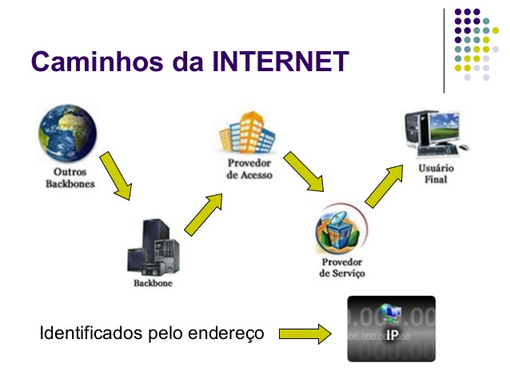

#Internet

   #  Como funciona a Internet 

   ### A Internet faz parte do nosso cotidiano. Todas as pessoas fazem uso das informações disponíveis na rede mundial de computadores. Por exemplo, ao pesquisar um produto para compra, ao realizar uma pesquisa sobre um assunto específico, ao enviar uma mensagem de texto através da sua rede social preferida, ao fazer uma chamada de vídeo, ao participar de uma aula remota, ou estudar na modalidade a distância, etc. 
<b>
    
   ### A Internet é um sistema global de redes de computadores interligadas que utilizam um conjunto próprio de protocolos (TCP/IP) com o propósito de servir usuários no mundo inteiro.
<b>

   ### A Internet faz um percurso até chegar à nossa casa. Este percurso passa por quatro passos principais, sempre identificados por um endereço de IP: o Backbone, o provedor de acesso, o provedor de serviço e o usuário final.  
 
   
 
 
  
  ## Backbone  
  ### Distribui pelas redes as informações baseadas na tecnologia TCP/IP. São poucos backbones espalhados pelo mundo e são responsáveis por distribuir o acesso mundial para a rede de Internet.
<b>
    
   ## Provedor de acesso
   ### São empresas ligadas ao setor de telecomunicações, ou até mesmo as próprias companhias telefônicas, que fornecem o acesso à Internet por meio de planos acordados com seus usuários. 
<b>

   ## Provedor de serviço
   ### São empresas que recebem os dados do provedor de acesso e distribuem aos usuários por meio de linha telefônica, fibra ótica ou via rádio (tecnologia sem fio).
<b>
    
   ## Usuário final
   ### Este pode parecer o passo final do caminho percorrido pela Internet, mas na verdade não é. Ao chegar no usuário final o sinal de Internet passa a repetir todo o caminho novamente, porém na forma inversa, já que você, como usuário final, também envia sinais - com as suas requisições - para a Internet. Os dados enviados pelos usuários são transportados pelo provedor de serviço, enviados para o provedor de acesso e chegam novamente ao backbone.
<b>

   ## Curiosidade sobre a internet
   ### Para pessoas que não desgrudam do celular até mesmo na hora de ir ao banheiro, existem na China hospitais específicos para internação e tratamento para viciadas em internet.
<b>
                                            
                                                               ## Publicado por: Inácia Simone

